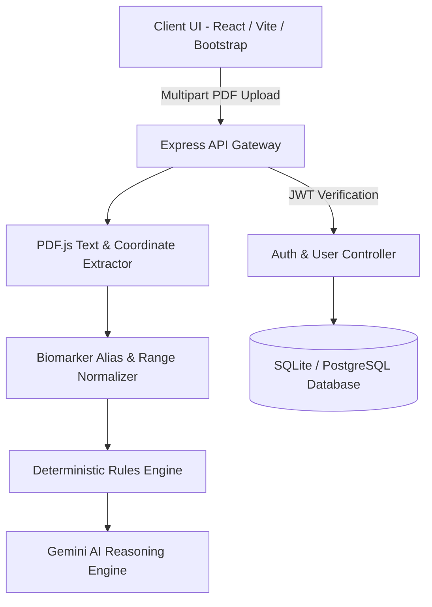

# 🩸 Hemoflow — Deterministic Blood Report Analysis & AI Reasoning

**Hemoflow** is an enterprise-grade medical data intelligence platform that combines **position-aware, multi-lab PDF parsing** with **deterministic rules evaluation** and **AI-driven biomarker reasoning**. 

It transforms unstructured, highly variable blood test PDFs (from labs like Thyrocare, Lal PathLabs, Suburban Diagnostics, and Dr. Lal) into standardized, actionable health insights.

---

## 🌟 Key Features

- **📍 Position-Aware PDF Extraction**: Utilizes `pdfjs-dist` to extract raw text coordinates, overcoming multi-column parsing errors and alignment mismatches in complex lab reports.
- **🏷️ Smart Biomarker & Alias Normalization**: Employs word-boundary regex matching to accurately map diverse biomarker aliases (e.g., *Fast. Glucose*, *FBG*, *HbA1c*, *Glycated Hemoglobin*) to standardized clinical definitions.
- **⚖️ Deterministic Range Evaluation**: Compares extracted values against biological reference ranges and categorizes markers into `PASS`, `ELEVATED`, `LOW`, or `NEEDS_REVIEW` with exact percentage deviations.
- **🧠 Gemini AI Reasoning Layer**: Synthesizes full blood panels with patient context (age, biological sex, fasting status) to generate cross-biomarker correlations and tailored recommendations.
- **🔒 Secure Authentication & Data Isolation**: Built-in user authentication powered by JWT and `bcryptjs`. Implements strict owner isolation for saved health reports.
- **⚡ Non-Blocking Persistence**: Ensures user analysis is never blocked by database latency or network outages—results are delivered instantly even if persistence encounters temporary issues.

---

## 🏗️ System Architecture



---

## 📂 Project Directory Structure

```text
hemoflow/
├── client/                      # React Frontend Application
│   ├── public/                  # Static assets & HTML index template
│   └── src/
│       ├── App.jsx              # Main view router & state manager
│       ├── AuthContext.jsx       # Authentication state context provider
│       ├── Dashboard.jsx        # Historical report tracking dashboard
│       ├── LoginForm.jsx        # User login form interface
│       ├── RegisterForm.jsx     # User registration form interface
│       ├── Navbar.jsx           # Global navigation header
│       ├── ResultsView.jsx      # Biomarker analysis display component
│       ├── UploadForm.jsx       # Drag & drop PDF uploader interface
│       └── index.css            # Custom CSS & design system tokens
│
├── server/                      # Express Backend Application
│   ├── middleware/
│   │   └── auth.js              # JWT verification & token generation
│   ├── migrations/
│   │   └── init.sql             # SQL database schema definitions
│   ├── routes/
│   │   ├── auth.js              # Authentication API endpoints
│   │   └── reports.js           # Historical report management routes
│   ├── tests/
│   │   ├── test_suite.js        # E2E & Authorization isolation tests
│   │   └── test_db_resilience.js# Non-blocking DB fallback resilience tests
│   ├── biomarkerParser.js       # Coordinate-aware parsing & regex matching
│   ├── db.js                    # Database connection pool & abstraction
│   ├── geminiReasoning.js       # AI clinical insights integration
│   ├── migrate.js               # Idempotent DB migration runner
│   ├── pdfExtractor.js          # pdfjs-dist buffer text extraction
│   ├── referenceRanges.js       # Standardized reference range definitions
│   ├── rulesEngine.js           # System group scoring & marker evaluation
│   └── server.js                # Main Express server entry point
│
├── docs/
│   └── api.md                   # Comprehensive REST API Documentation
│
├── scripts/
│   └── eda_blood_biomarkers.py  # Exploratory Data Analysis & visualization script
│
├── .gitignore                   # Version control ignore rules
├── README.md                    # Production documentation
└── package.json                 # Project configuration
```

---

## 🚀 Quickstart Guide

### Prerequisites
- **Node.js**: v18.0.0 or higher
- **npm**: v9.0.0 or higher
- **Python**: 3.9+ (Optional, for running EDA scripts)

---

### 1. Backend Setup

```bash
# Navigate to server directory
cd server

# Install dependencies
npm install

# Configure Environment Variables
cp .env.example .env
```

Edit `server/.env`:
```env
PORT=5000
JWT_SECRET=your_super_secret_jwt_key
GEMINI_API_KEY=your_google_gemini_api_key
DATABASE_URL=hemoflow.db
```

Start the backend server:
```bash
npm start
```
*The server will run on `http://localhost:5000` and automatically initialize database migrations.*

---

### 2. Frontend Setup

In a new terminal window:
```bash
# Navigate to client directory
cd client

# Install dependencies
npm install

# Start React development server
npm start
```
*The frontend application will open automatically at `http://localhost:3000`.*

---

## 📖 API Documentation

Detailed REST API specifications, payload samples, and authentication details are located in [`docs/api.md`](file:///c:/Users/admin/.gemini/antigravity-ide/scratch/hemoflow/docs/api.md).

### Summary of Core Endpoints

| Method | Endpoint | Auth Required | Description |
|---|---|---|---|
| `POST` | `/api/auth/register` | No | Register a new user account |
| `POST` | `/api/auth/login` | No | Login and obtain a JWT token |
| `GET` | `/api/auth/me` | Yes | Retrieve current user profile |
| `POST` | `/api/analyze` | Optional | Upload & parse blood report PDF |
| `GET` | `/api/reports` | Yes | List saved historical reports |
| `GET` | `/api/reports/:id` | Yes | Get full analysis details for a report |
| `DELETE` | `/api/reports/:id` | Yes | Delete an owned historical report |

---

## 🧪 Testing & Resilience Verification

Hemoflow includes automated integration testing to ensure security, owner authorization isolation, and database resilience.

### Running Integration & Security Tests
Verify authentication isolation and multi-lab PDF processing:
```bash
cd server
npm test
```

### Running Non-Blocking DB Resilience Tests
Verify that analysis results remain 100% available even if the database experiences simulated failure:
```bash
cd server
npm run test:resilience
```

---

## 📊 Exploratory Data Analysis (EDA)

An exploratory data science script is provided in `scripts/eda_blood_biomarkers.py` to analyze biomarker distributions, outliers, and cross-correlations across synthetic patient panels.

```bash
# Install Python dependencies
pip install pandas numpy matplotlib seaborn

# Run EDA script
python scripts/eda_blood_biomarkers.py
```

---

## 🔒 Security & Data Privacy

- **Password Safety**: User passwords are never stored in plaintext and are salted/hashed using `bcryptjs` with 10 salt rounds.
- **Stateless Sessions**: Authentication utilizes signed JWT tokens with 24-hour expiration.
- **Authorization Isolation**: Database queries enforce `user_id = $1` filters, preventing cross-user data leaks or unauthorized resource access.
- **Non-blocking Data Layer**: Clinical insights are processed synchronously, ensuring data persistence failures never impair patient report viewing.

---

## 📄 License

Distributed under the MIT License. See `LICENSE` for more information.
